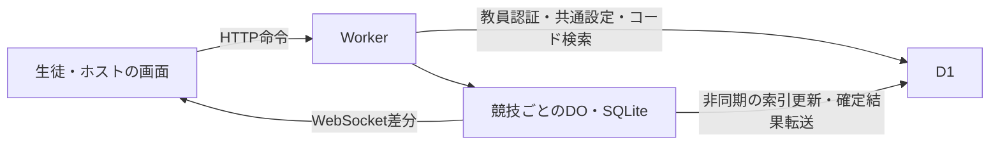

# Cloudflare版イオンコンペ — 授業時の応答改善仕様

日付: 2026-10-09 JST。状態: 設計完了・実装前。

対象: `KoiChem/IonicFormulaCompetitionCloudFlare`。調査基準コード: `7b585fbb3994165cade617edc869f684c48c2f0f`。

## 1. 決定と目的

**1競技＝1 Durable Object（DO）を維持し、DO内SQLiteを新規V2競技の唯一の正本にする。** 保存・採点・進捗・開始/終了・結果確定をそのDO内で完結する。D1は教員認証・共通設定・競技検索用の索引・確定結果のアーカイブを担当する。

第一実装は既存のHTTP命令と冪等な保存ACKを維持し、状態更新にはHibernation WebSocketの差分通知を使う。通知を受けるたびに全状態をHTTPで取り直す通常経路は廃止する。

前の調査案にあった「D1を軽量化し、不足した場合だけDO SQLiteへ移す」という順序を修正する。DO SQLiteへの移行を完成形の主案とし、D1側の改修は既存競技を維持する互換経路に限定する。2026-10-08独立版設計の「D1が競技の正本、DOはmetadataのみ」という部分と通知方式は、本仕様が置き換える。他の認証・教材・競技契約は維持する。

意図は、授業で20名程度が一斉に参加・開始・解答・提出しても待ちが積み重ならず、ホストの進捗と結果が速やかに表示されること。既存上限のClass50名、Mate4名にも同じ構成を適用する。

Supabase版を変更しない。ChatGPT Sites版を変更するには別途ユーザーへ確認する。本仕様の作成はアプリ実装・本番DB変更・公開の実施ではない。

## 2. 判断の根拠と比較

2026-10-09の申告時刻に合う競技は18名、V2、まとめて判定、10問。記録上の開始10:08:47、終了10:12:47 JST。ユーザーは参加確認・開始・ホスト反映・結果表示すべてが遅いと報告した。

10:05〜10:15の集計ではWorker成功リクエストのrequestDuration中央値4.44秒、95%点8.96秒。対象DOの成功HTTP wallTime中央値4.73秒、95%点9.32秒に対し、CPUは8.85ms/29.57msだった。DO HTTPにはWS接続処理も含まれ、Worker集計はURL別ではない。これを各画面操作の正確な応答時間や原因別内訳とは扱わない。

コードでは全HTTP/WS認証/alarmの直列tail、state1回あたり概算18回のD1往復、毎GET後の通知同期・再認可、COUNTDOWN後の追加3回state読取、時間切れ再送が見つかった。CPU負荷より外部I/Oと待ち行列を減らす設計が適している。詳細な過去ログは現在の権限で取得できなかったため、個別切断原因は未確定。

| 案 | 評価 | 決定 |
|---|---|---|
| DO内SQLite＋HTTP命令＋WS差分 | 競技処理と保存を同じ場所に置き、現在の命令/再送契約を再利用できる | 採用 |
| D1正本のまま往復/通知を削減 | 移行量は小さいが、競技中の外部DB待ちと競合制御が残る | 旧競技の互換経路に限定 |
| DO内SQLite＋全命令WS化 | 接続済み通信の残余遅延を減らす候補だが、命令ACK・切断・HTTPとの混在再送が増える | 第一実装に含めない |

Cloudflareはゲームセッション等、協調が必要な単位ごとのDOを推奨する。DO内SQLiteは処理と同じプロセスにあり、SQLに外部ネットワーク往復がない。このアプリで上記構成が最適とする判断は、公式資料と実装・授業記録からの設計上の判断であり、改善後の速度は受入試験で確認する。[DO設計指針](https://developers.cloudflare.com/durable-objects/best-practices/rules-of-durable-objects/)、[Workers PlacementのDO説明](https://developers.cloudflare.com/workers/configuration/placement/)

参加者別のDO分割、全競技を一つのDOへ集約、競技状態のKV保存、DOとD1の両方を正本にする同期書込、開始/終了のQueues経由通知、全体tailだけの削除、timeout延長だけの対処は採用しない。

## 3. 構成と正本の境界

| 保存内容 | 正本・参照元 |
|---|---|
| 教員identity/session/allowlist、共通出題設定 | D1 |
| 作成予約、参加コード→publicId/engineの索引 | D1 |
| 新方式の設定snapshot、参加資格、問題、操作、receipt、進捗、phase、結果 | 当該DO内SQLite |
| 新方式の一覧用phase/count、確定結果アーカイブ | DOからのprojection。競技中の判断に使用しない |
| 旧方式の全競技データ | 従来D1。進行中・待機中・終了済みのいずれも移送しない |

現在の`RoomCoordinator`は既に`new_sqlite_classes`で作成されている。同じclass/binding/namespaceを維持し、ローカルSQLスキーマとengine境界を追加する。KVからの基盤移行、新しい全体coordinator、Wranglerの`exports`形式への変更は不要。

`storageEngine = 'd1-legacy' | 'do-sqlite-v1'`は作成時に固定し、ゲームの`gameVersion`とは別に管理する。既存全ルームとV1互換作成は`d1-legacy`。新しい現行UIのV2作成は、新方式有効時に`do-sqlite-v1`とする。

`/api/rooms/:publicId/*`はWorkerから直接同じ`idFromName(publicId)`のDOへ送る。新方式の毎リクエストでD1のengine検索をしない。DOのlocal metaにengineを永続化し、旧DOだけ初回にD1索引から確定する。未知engine・初期化途中・索引不整合は503等の明示的エラーとし、別engineへ切り替えて書かない。

日本の学校利用を前提に、新規DOの最初の取得へ`locationHint: 'apac-ne'`を指定する。既存DOの位置は変更しない。hintはbest effortであり、NRT固定や日本国内保存の保証とはしない。Smart PlacementとD1 Read Replicationは今回の必須構成にしない。[DO配置仕様](https://developers.cloudflare.com/durable-objects/reference/data-location/)

## 4. 保存する状態と競技契約

DO SQLiteへ以下を永続化する。メモリcacheやWS attachmentを正本にしない。

- room meta: public/internal ID、engine/schemaVersion/authorityEpoch、kind、owner/mateHost、設定、roomRevision、作成/準備/開始/締切/cutoff/collection/確定/閲覧期限。
- 教材snapshot: 作成時の出題profile、dataset/evaluator version、manifest ID、問題順序、public question、answer snapshot、preparationGeneration。
- participant: ID、token hash、nickname/key、joinedOrder、status/revision、readyGeneration、writerEpoch、ackSeq/acceptedSeq、lastElapsed、採点projection、finish/boundaryACK。
- append-only操作log、命令/保存batchのreceipt、確定順位・本人review・集計。
- control/host/selfの通知revision、未配信状態、索引/アーカイブoutbox、次回alarmの根拠となるdue時刻。

維持する値と挙動を以下に固定する。

| 項目 | 契約 |
|---|---|
| 上限 | Class50名、Mate4名。51人目/5人目を拒否 |
| 問題・時間 | 5/10/15問、制限3〜10分、全員同じ問題・順序 |
| 教材 | 現在の難易度/ON・OFF、錯のみ、錯イオンを含む化合物、イオンの分散選択を維持 |
| 準備 | Class最低1名、Mate最低2名。全ACTIVE参加者の同generation readyで開始決定 |
| 待機・準備 | WAITINGは2時間。PREPARINGは30秒を超えて自動開始しない。取消後の再準備はgeneration更新 |
| 開始 | 共通の`startAtMs`、5秒countdown。設定が同じ再準備では既存の問題再利用契約を維持 |
| 回収 | `collectionUntil = cutoff + 10,000ms`。条件が揃えば10秒を待たず確定 |
| 保持 | Class結果は確定から7日、Mate結果24時間、取消24時間。期限到達時点で閲覧/操作拒否 |
| 可視性 | Class生徒は上位3位＋本人の成績/本人review。教員は全順位/集計。Mateは全順位＋本人review |
| UI | 日本語、化学式/電荷、QR、IME/Enter、44px操作、390px幅、操作列2:3:2、活動中runnerの汗・手足、提出後休止、軽量モードを維持 |

即時判定はローカル反応を維持するが、最終点数はサーバーが検証する。出題分の即時answer snapshot配布は現契約を維持し、教材全体を配布しない。まとめて判定の途中ACKは正解数0とし、最終確定まで正誤を他参加者へ漏らさない。

進捗は、即時では現在の正解欄数のモデル、まとめてでは「解答のある問題から明示的に次へ進んだdistinct問題数」を使う。draft自動保存、単なる現在問題番号、戻る、同じ問題の再advanceを進捗加算に使わない。

## 5. 作成・認証・HTTP命令

### 作成と復旧

D1へ追加の`cf_room_registry`、作成intent、projection/archive管理を設ける。適用済みmigrationを変更しない。既存roomを索引へbackfillし、参加コードの一意性を新旧共通で維持する。新規V1互換作成は旧roomとregistryを同じD1 batchで保存する。

Mate作成の「同creation keyの未終了roomは1室」「10分に3室まで」「Mate無効時は新規作成不可」を新旧共通のD1 transactionで守る。actor keyはhashだけを保存し、RESERVEDも作成回数とcreator active leaseへ含め、同予約の再送は重複計数しない。新旧作成が同時でも共通lease/履歴で判定する。

native roomのterminal commitはlease解除outboxを保存する。解除が未反映なら次の作成処理が当該DOのterminal状態を一度確認し、roomId/authorityEpoch一致のCASでleaseを解除してから再判定する。遅延した一覧phaseから未終了かを推測しない。RESERVEDの初期化期限は最初の予約から60秒、超過は非公開取消・lease解除とし、遅れて届いたinit/activateを拒否する。

新方式の作成は次の冪等な段階で進める。

1. D1で作成権限・設定を検証し、creationKey/requestId/bodyHash、固定publicId/hostId/tokenHash、profile snapshot、engine、join codeを`RESERVED`として保存する。同じ要求は同じ予約へ戻す。
2. 同じ予約とpayload hashでDOを初期化する。init/activateはWorkerの内部管理経路だけから行い、外部のroom API・偽装headerからは呼び出せない。予約が違うinit、同IDで異なるpayloadは拒否する。未初期化roomを公開しない。
3. DO activationとD1 registryの`ACTIVE`公開markerを成立させる。両方の確認後に201を返す。どの段階のACKが失われても同じ予約から続行する。
4. `RESERVED`中のjoinは一時的な準備中応答で再試行可能にし、legacyへpinしない。作成が完了しなければ予約から60秒で無効化し、非公開予約/DOの物理回収は第9節のcleanup基準へ従う。

Mate host tokenはクライアント生成・端末保存済みのものをBearerで送る現契約を維持する。サーバーにはhashのみ保存する。再送でhostIdを生成し直したり、生tokenを作成receiptへ保存/再返却したりしない。同じcreationKey/requestIdで異なるtoken/bodyは409。

### 認証の処理境界

- 生徒/Mate hostのstate/save/ready/resultsは、DO内token hash・status・role・expiryで認可する。生徒のACKへ教員のD1認可処理を付けない。
- 教員HTTP命令はGoogle sub、有効session、allowlist/master、設定一致、ownership、CSRFを現在のD1で検証する。外部認証はローカル状態transactionの前に行い、transaction内で最新phase/revision/ownershipを再確認する。
- 教員WSの配信は、送信する集約batchごとにsession/allowlist/master/auth configを1つの統合D1読取で確認する。古いreplicaや長寿命の許可cacheは使わない。このawaitは教員向け配信だけに限定し、生徒ACK・生徒control配信を止めない。
- D1認可失敗時は教員への配信/命令をfail closedにする。生徒の保存と本人結果表示は続けられる。したがって「D1障害でも全ホスト操作が可能」とは約束しない。
- REMOVED・token変更・room expiryはDO内で即時に反映し、対象WSを閉じる。roleをクライアント申告で決めない。cookie/Authorization/internal headerの偽装、別room資格を拒否する。

教員の配信pumpはprincipal/session単位でsingle-flightとする。認可await中のdirtyは最新状態へ累積し、完了後にepoch・expiry・現在session・接続ごとのcursorを再確認して送る。認可失敗でdirtyを送信済みにせず、一時失敗は保持して再試行、失効確定は接続を閉じる。異なる認可応答の順番で古いpatchを後から送らない。

### 命令transaction

既存のroom HTTP API・JSON error・requestId契約を維持する。新方式のjoin/nickname/settings/start/ready/cancel/interrupt/remove/operations/writer/resultsをDO adapterへ振り分ける。legacyの`actions`を含む既存APIは維持する。

body解析、hash計算、必要な外部認証を済ませた後、現在状態検証・domain更新・操作log・projection・receipt・revision/outboxを原子的に保存する。純SQLは`ctx.storage.transactionSync()`を使い、そのcallbackに`await`を入れない。

alarmのearliest dueも変更する命令は、SQLite-backed storageの短い`ctx.storage.transaction(async () => { 同期SQL更新; await ctx.storage.setAlarm(earliestDue); })`でSQLとalarmを一体に保存する。この中にはlocal storage以外のawaitを入れず、SQL cursorは外部await前に同期的に消費する。外部I/Oを囲む全体tailは新方式へ使わない。`blockConcurrencyWhile`は短い初期化/スキーマ更新だけに使う。[SQLite transaction仕様](https://developers.cloudflare.com/durable-objects/api/sqlite-storage-api/)

ACKとWS配信はローカル保存の確定後に出す。runtimeのoutput gateを維持し、保存前ACKを許す設定を使わない。D1 projection/archive完了、全socket再認可、全名簿fingerprint比較をACKの条件にしない。

interruptはrequestId/bodyHash/expectedRevisionをtransactionで検証し、有効RUNNING（`now >= startAtMs`）でのみ新しいcutoffを設定する。開始前に負のelapsedを作らない。COLLECTING以降のcutoffは固定し、再送はreceiptで元応答を返す。writer takeoverにもrequestId付きreceiptを追加し、旧形式呼出しは従来CAS互換として受け付ける。

## 6. 操作保存・採点・締切

第一実装では既存の純粋関数`replayV2Operations`を再利用する。当該参加者の履歴をDO内SQLから取得してreplayし、結果projectionを同じtransactionで保存する。採点を増分reducerへ書き換えることは第一実装の条件にしない。問題数だけでなく、誤答・draftの長い操作履歴でも性能を測る。

確定時は、まず`gradeDeferred=false`のreplayでlive projectionを検証し、次に`gradeDeferred=true`で最終採点する。まとめての途中正解数0と、最終採点後の正解数を同一として比較しない。interruptでcutoffが変わった場合は、その新境界でlive projectionを再計算してから検証する。不一致なら推測で順位を確定せず、データを保持し安全に診断する。evaluator versionは競技単位で固定し、保持中のroomを処理できる評価器をデプロイ/rollback版に残す。

- batch上限128操作/128KiBを維持。新batchは`ackSeq + 1`から連続し、operationIdは参加者内unique、elapsedは単調増加。manifest/evaluator/writerEpoch一致を要求する。
- room資格・REMOVED・expiry・expectedAuthorityEpochを先に検証し、そのauthorityEpoch内で同一requestId/bodyのreceiptをwriterEpoch/phaseの新規受付判定より先に照合する。保存済み再送は同authorityEpoch内のtakeover・FINISHED・回収終了後も元ACKを返す。異なるbodyは409とし、PITR前のauthorityEpochのreceiptは返さない。
- `ackSeq`は永続受領位置、`acceptedSeq`は締切条件に沿った受理位置。混同して未送信記録を消さない。
- 送信中batchはACKまでrequestId/body/epochを固定する。次の入力を同じbatchへ追記しない。timeoutを未保存の証拠とせず、同じ要求を再送する。takeoverでseqをゼロへ戻さない。
- native mutationは`expectedAuthorityEpoch`も検証する。旧HTTP形式の省略値は初期epoch 1として互換受理し、PITR後等の新epochでは省略/不一致を再同期要求として拒否する。
- 端末時刻の未来許容は250ms。`startAtMs + elapsedMs > serverNow + 250ms`を拒否する。受信時刻・処理時刻・端末申告時刻を区別する。過去elapsed不正の完全防止を新たに保証しない。
- 得点対象は原則`eventAt < cutoff`。通常timeoutのdraftだけ、`eventAt == cutoff`かつ`editedAt < cutoff`を許す。interruptにこの例外を適用しない。
- 新batchは処理時刻`>= collectionUntil`で拒否する。alarmが遅れても、ローカルtransactionがこの境界を検証する。
- 全員completed/submittedなら早期確定。COLLECTING中は全員finish済みまたは正しいboundaryACKなら早期確定し、それ以外は回収期限で確定する。未確認者には`finalSyncUnconfirmed`を保持する。
- 順位は正解数降順、elapsedのcentisecond切捨値昇順、joinedOrder。同正解数・同centisecondは同順位とし、次順位は人数分飛ばす。

通常answer/passの送信集約待ちは最大100ms。advance/finish/readyは端末保存完了後に即flushする。deferredの普通のキー入力ごとのネットワーク送信は増やさず、現在のdraft保存/送信契機を維持する。1人につきHTTP保存は同時に1件までとし、完了前の新要求は次batchで待つ。

## 7. WebSocket・時計・再接続

### 初期同期と差分

新方式は`protocolVersion: 2`、legacyは`invalidate-v1`のcapabilityを返す。既存クライアント向けのstate/manifest/HTTP契約も保持し、新しい画面はengineとcapabilityに従う。

新クライアントは認証frameに`supportedProtocols: [2, 1]`を送る。項目のない旧クライアントには、DO新方式のroomでも`authenticated`と従来の`epoch: 1 / kind: control|host`のinvalidate通知を返す。旧クライアントの再取得先はDO内の互換stateであり、D1競技データへ戻さない。version 2へ合意したsocketだけに直接適用patchを送る。未知versionは合意済みversion 1へ戻すか接続を拒否し、解釈できないpatchを送り続けない。

join/create ACKの初期情報を再利用し、再訪は軽量bootstrapでphase/expiry/role/manifest参照を得る。bootstrapと旧全stateを両方呼ばない。WS認証成功時にrole別snapshotを同梱し、初期snapshot直後の追加GETをしない。

新WS snapshot/patchはroomId、protocolVersion、authorityEpoch、scope、baseRevision、revisionを持つ。業務のroomRevision/participantRevision、writerEpoch、preparationGenerationとは別に扱う。scopeはcontrol、host、本人self。権限のないscopeや他人の回答本文を送らない。

snapshot baselineを原子的に固定し、その後の差分を同socketで送る。`baseRevision == 適用済みrevision`ならpatch適用、古いrevisionは重複として無視する。不一致時は当該scopeを止め、同socketのresyncで最新scope snapshotを得る。毎GETを全員へ発火しない。

hostは変更時だけ最大250msで集約し、参加者ID単位のabsolute upsert/removeを送る。最後の送信baselineからの累積差分とし、revisionの飛びを集約の正常動作として扱う。生徒のphase/開始/中断/削除/FINISHEDはhost集約を待たない。selfのACK/進捗とdraftの表示状態を分離し、server snapshotで未ACKの手元編集を上書きしない。

baseline/cursorはscopeごと・socketごとに保存し、新規接続snapshotと次patchを同じ接続のbaselineへ揃える。250msは意図した集約待ちの設定上限で、runtimeの実配信遅延保証ではない。競技中の変更時だけ短いsetTimeoutを一つ使うfast pathと、永続alarmによる停止復旧を併用し、新しいdirtyで最初のdueを先送りしない。

self snapshot/patchはserver受領状態の表示へ使う。第一実装ではIDBのack/inflight消去は、HTTP命令応答またはreceipt確認によりroom/authorityEpoch/manifest/writerEpoch/requestId/batchの同一性が一致したときだけ行う。ackSeqの大小だけで別writerの操作を確認済みにしない。不一致の古い応答は現在のinflightを消さず、手元記録を保持して照合へ移る。

小規模な20〜50名なので再接続は最新role snapshotで回復する。無制限の通知replay logは設けない。authorityEpochが変わったら古いpatchを混ぜず、再bootstrapと未ACK記録の照合を要求する。cold start/hibernationだけではauthorityEpochを変えない。

### 認証・接続寿命

same-origin制限を維持し、participant tokenは最初の認証frameに送る。URL/query/logへ入れない。未認証期限はupgradeから最初の認証frame受信まで5秒とする。認証処理を保存待ち行列に並べず、期限内に届いたframeを処理待ちだけで恒久資格拒否に変えない。browserの認証待ちは接続開始から8秒を上限とする。

invalid credential/removed/revoked/expiredは停止する資格拒否、一時auth timeout/busy/restartは再接続可能な理由として区別する。upgrade失敗の理由をbrowserが読めない場合、軽量bootstrapで一度確認する。1005/1006等の送信不可close codeを送らない。

Hibernation APIを使い、attachmentはprincipal ID/hash参照・expiry・scope/cursor等の小さい情報だけにする。解答/receiptはSQLiteへ保存する。constructorで復旧し、常設setIntervalや毎秒alarmを置かない。ping/pongはruntimeのauto-responseを使い、時計同期と分ける。[Hibernation WS仕様](https://developers.cloudflare.com/durable-objects/best-practices/websockets/)

### 時計と復旧の間隔

時計はWSの`clock_request → clock_response(serverReceivedAtMs, serverSentAtMs)`で小さい3サンプルを採る。D1・通知同期・全stateを通さず、server処理時間を除いたRTT最小サンプルを使用する。WS非対応時だけDO内の軽量HTTP clockを使う。開始/再接続/background復帰時に必要な再同期をし、境界時に全員のstate GETを発火しない。

通常経過時間は`performance.now()`を使い、elapsedを後退させない。COUNTDOWNの共通startAtで各端末が表示を進め、サーバーの期限判断を上書きしない。

WS再接続は0.5→1→2→5→10→30秒、±20% jitter、認証/snapshot成功でreset。offline/非表示時は頻繁な接続を止め、visible/online復帰で1回起動する。

healthy WS利用者の定期HTTPはゼロ。WS遮断時は軽量statusをparticipant通常2秒、準備/countdown/collectingは1秒、hostは1秒、±20% jitterで取得する。1人/roomあたり同時1要求とし、連続失敗は1→2→4→8→16→30秒へbackoff、429のRetry-Afterを優先する。statusに必要な差分/phase/時刻/本人ACKを載せ、全問題/全reviewを含めない。

保存write、WS接続、scope回復、結果詳細、ホーム履歴の再試行を分離する。通常operationsの試行timeoutは最大5秒、その他命令は最大10秒とする。これを通常応答の目標値と混同しない。

COLLECTING受信または手元のcutoff到達時は、進行中operationsの残り待ちも最大1秒へ短縮する。collection中の新しい試行は`min(1,000ms, collectionUntil - serverNow - 200ms)`、残り200ms以下では新batchを発行せず未確認状態を保持する。Abortしても同じrequestId/bodyを変更しない。

軽量`operation-status`で当該requestIdの保存済みreceiptをDOから確認できるようにし、ACK喪失時は確認→同要求再送の順に進める。確認要求もcollection中は最大1秒、同時1件とし、保存済みACKを照合して次のfinish/boundaryACK batchを直ちに送る。回収終了後は新batchを送らず、保存済みreceiptの確認だけを行う。通常再送待ちは1→2→4→8秒、collection中は最大1秒。失敗中でも届いたcontrolの適用・手元の締切処理を止めない。

## 8. 参加確認・開始・結果・端末保存

join/createと競技への復帰成功時に「最後に参加中と確認したroom」のhintを端末に保存する。Homeの参加確認はそのhintを最優先で1件確認し、残りの枠でほかの期限内候補を新しい順に軽量statusで取得する。hintを含む全体の同時要求は最大3件とし、hint完了をほかの候補の開始条件にしない。hintは確認済み現在状態と同一視しない。

履歴200件の保存上限は変えないが、見つかった有効リンクをその時点で表示し、全200候補の完了を待たない。現在roomへ遷移したら不要な候補通信を停止する。曖昧なtimeoutで参加資格を削除しない。確認中表示は現在の予約済み余白へ収める。

PREPARINGではmanifest/evaluator/generation一致とIndexedDB保存完了後にreadyを送る。取消→再準備は古いgenerationのreadyを拒否する。開始命令のACK喪失はrequestId/start-statusで回復し、新しい開始を重ねない。

FINISHEDは確定結果の保存後に送る。role別の結果要約を通知/snapshotに載せ、要約を先に表示し、本人reviewや教員詳細を一度取得する。D1アーカイブ完了を待たない。詳細取得に失敗しても表示済み要約を消さず、再試行状態だけを示す。全結果の複数回失敗後まで要約を待たせない。

IndexedDBは接続を再利用し、immutable manifest、変更draft、append操作、ACK/inflight/cursor metadataを分ける。回答/移動/提出の関連draft＋操作＋metadataを同じtransactionへ保存し、完了後に送る。入力表示は即時にし、「端末保存済み」はtransaction完了後だけ表示する。debounceで現在より未保存区間を広げない。旧記録は移行失敗だけで削除しない。

時計/retry表示を独立componentへ分け、player全体250ms再描画と全操作再集計を減らす。ゲーム意味・入力順序・IME・キーボードの見た目を変えない。

## 9. Alarm、非同期転送、保持期限

DOはalarmを一つだけ保持する。準備timeout、start/deadline、collection、host dirty、未配信control、索引/アーカイブ再試行、expiryの最も早いdueを登録する。dueとalarmの更新は第5節のlocal storage transactionで一体保存し、古いtaskの計算結果で早いalarmを上書きしない。constructorで既存alarmを先送りしない。

alarmはat-least-onceを前提に、遷移と転送を冪等にする。alarm本体は到来済みのローカル遷移、永続job lease、次due/alarm登録を済ませて短くreturnする。D1認可/転送はbounded background taskへ分離し、同時一つのalarm handlerを外部通信待ちで占有しない。

background taskは1 jobあたり10秒でアプリ側の待ちを打切り、永続lease/retryから復旧する。`waitUntil`だけを再送の根拠にせず、遅れて完了したcallbackはepoch/expiry/job lease/revision一致を再検証する。標準の有限回retryだけへ依存せず、失敗したoutboxに次のdueを保存してalarmを再設定する。保守/failoverによるalarm遅延を許容し、HTTP/時計の境界判断とforegroundの短い通知timerで補う。[Alarms API](https://developers.cloudflare.com/durable-objects/api/alarms/)

索引projectionはroomRevision単位で集約し、live進捗を毎操作D1へ写さない。一覧phase/countの更新は通常2秒以内を目標にし、参加/開始/結果の真偽はDOへ確認する。D1へはauthorityEpoch/projectedRevision付きで書き、古いrevisionの遅延到着で新しいphase/countやexpiryを巻き戻さない。

結果確定transactionはimmutable final snapshot＋event revision＋archive outboxを同時保存する。D1キーは`(publicId, authorityEpoch, finalRevision)`、payload hash/evaluator/expiryを含める。同key/hashの再送は成功、異なるhashは409相当の破損として拒否する。

D1は全結果・review・問題snapshotとcompletion markerを原子的に公開する。分割転送はstagingへ保存し、全件/hash検証後にmarkerを公開する。途中データを結果APIへ出さない。D1書込ACK後にのみDO outboxを完了にする。転送ACK喪失は同じkey/hashで再試行する。

転送retryは1→2→4→8→16→30秒、その後最大5分、jitter付き。期限内はDO結果表示を維持し、D1の遅延でゲームを止めない。5分超の未転送またはhash不一致を運用エラーとして記録する。D1アーカイブを自動的にlive正本へ昇格させない。

expiryはarchive完了待ちで延長しない。expiry到達時点で両経路の操作/閲覧を拒否し、WSを閉じる。DO内nickname/token hash/回答/log/receipt/review、D1アーカイブ/索引の個人データを削除する。古いexport/initが期限切れデータを復活させない。

D1削除前に非個人tombstone/current authority generationを固定する。全export・staging completionは「有効registryが存在、tombstoneなし、current generation一致、D1処理時刻がexpiry未満」の条件付きtransactionとする。DO init/activateも予約期限・tombstoneを確認する。publicIdを再使用せず、registry削除後も存在しないregistryへの古いexportを拒否する。

15分Cronはboundedな削除仕事を処理し、期限切れDOのpurgeも呼ぶ。未完了purgeは非個人のpublicId/engine/expiryだけを持つ再試行記録として残し、完了まで追跡する。通常の健全なサービス状態で30分以内の物理cleanupを検収する。障害中も論理的な期限拒否を維持し、復旧後に削除を再開する。PITR/プラットフォームの復旧保持を、アプリの結果閲覧期限と混同しない。

## 10. 移行・公開・rollback・復旧

1. 追加D1 schema/registry backfillと両engine対応bridgeを作る。新方式の作成flagはOFF。全既存roomをlegacyに固定し、互換試験を通す。
2. 専用test Worker/DO/D1で新方式を有効にし、本仕様の機能/障害/負荷/browser試験を実施する。本番へ模擬負荷を送らない。
3. 公開が別途承認された後、bridge版を本番へ置き、指定した教員の新規V2roomから新方式を検証する。既存roomは全phaseで旧方式を続ける。
4. 検収後に新規V2の既定engineを切り替える。画面の教材設定やURLを別サービスへ移さない。

新方式flagをOFFにしても、既存DO roomの保存・終了・結果・expiryを維持する。rollback先は必ず両engineと保持中schema/evaluatorへ対応するbridge版とする。D1専用旧Workerへの単純rollback、DO roomをlegacyへ切替、進行中のlive移送は行わない。

SQLite schema migrationは短く、原子的・前方互換にする。保持中roomのschemaを読めないreleaseは公開しない。新旧クライアントが混在してもHTTP/legacy WSが動き、未知capabilityは安全な再同期へ戻す。

通常のcold start/hibernationはSQLiteから復元する。PITRは運用担当が対象DO/時刻と影響を確認して行う災害復旧で、進行中競技の自動巻戻しには使わない。

PITRの前にWorkerのrecovery guardを有効化し、対象roomをDO外のD1 quarantineへ登録する。guard有効時だけWorkerが対象routingのprimary認可を確認し、対象HTTP/新WSを拒否する。旧接続を閉じ、guard版が全trafficへ適用されたことを確認してから復元する。通常運用の各リクエストへこのD1読取を追加しない。

D1に非巻戻しのrecovery generationを確定し、復元後のDOへinternal管理操作で新authorityEpochと隔離状態を固定する。このstampが確認できるまでquarantineを解除しない。HTTP mutationはexpectedAuthorityEpochで旧世代を拒否する。古いACK/receiptを新世代に混ぜず、全接続へsnapshot再同期を要求する。復元した進行中競技は中断/確認対象として扱い、勝手にRUNNINGへ再開しない。結果訂正が必要なら新しいfinalRevisionとhashで明示的に扱い、以前のアーカイブを黙って上書きしない。[DO SQLite/PITR](https://developers.cloudflare.com/durable-objects/api/sqlite-storage-api/)

Free/Paidのプラン変更、料金発生を伴う新サービス追加、他アプリの共有認証変更は本仕様の実施へ含めない。現在の契約枠で検証し、実測のrequest/CPU/duration/rowsと利用見積りから枠不足があれば公開判断の前に提示する。無制限無料やFree枠内の性能保証をしない。

## 11. 計測と受入基準

Workers/DOのObservabilityを実装段階で有効化する。`observability.logs.head_sampling_rate = 1`を維持し、専用負荷試験・公開候補・初期運用7日間はアプリの構造化completion logを全件出す。以後は成功completionだけ10%の条件付きemit、error・5秒超・archive未転送は100% emitとする。head sampling自体を10%にしてerror全件取得を約束しない。

自動`invocation_logs`は専用試験/初期7日間は有効、以後は無効として量を抑え、構造化ログと例外収集で診断する。計測する期間とログの保持期間は別である。現在のFree保持3日/Paid7日を前提に、検証集計は期限内に秘密を含まない成果物として保存する。現在の料金/日次上限を確認し、上限による欠測も記録する。氏名/nickname、回答本文、Bearer/cookie/CSRF、secretを記録しない。[Workers Logsのsampling/保持](https://developers.cloudflare.com/workers/observability/logs/workers-logs/)

spanはroute/role/engine/release、request/command ID、queueWait、認証、localSQL/replay、commit、host集約/配信、D1projection/archive、response bytes、retry/fallback/close reasonを分ける。初期化/cold/warm、通常/障害、WS/HTTP fallbackを別集計する。

本番WorkersのJS時計は同期CPU区間で進まないことがある。localSQL/replayの0msを処理時間ゼロとせず、runtime CPU集計/profilingと操作数/rowsを併用する。transactionSyncからのreturnと永続flushも区別し、durable ACKはクライアント受信まで測る。計測だけの追加awaitを通常命令へ入れない。第一実装ではWorkers Tracesを必須にせず、独自の相関ID付き構造化計測を使う。[Workersの時計制約](https://developers.cloudflare.com/workers/runtime-apis/performance/)

構造的な受入条件は、新方式participantのstate/status/manifest/operations/ready/clock/本人resultsの通常経路にD1 awaitがゼロ、変更のない読取で通知fingerprintを書かない、通常WSイベントで全stateを取り直さないこと。教員認可と非同期転送は別spanにする。

以下は達成済み値ではなく、実装後の検収目標。専用remote環境で日本からの安定したオンライン条件（baseline RTTを実測、目安100ms以下）を20/30/50名で測る。ネットワーク条件も結果に併記する。

| 対象 | 起点→終点 | 目標 |
|---|---|---|
| 入力/正誤反応 | tap/key→値/判定描画 | p95 ≤100ms |
| 端末保存 | 編集→IDB transaction完了 | p95 ≤100ms |
| 解答ACK | dispatch→durable ACK受信 | p95 ≤500ms、p99 ≤1秒 |
| 生徒操作→ホスト | 解答/advance操作→進捗描画 | p95 ≤1秒 |
| Home参加確認 | Home表示→現在roomの確認済み復帰リンク | p95 ≤2秒 |
| 参加 | join操作→本人の参加確定 | p95 ≤2秒 |
| 開始命令 | dispatch→準備開始ACK | p95 ≤500ms |
| 準備配信 | PREPARING commit→各端末表示 | p95 ≤500ms |
| 各端末準備 | manifest要求→IDB保存/ready ACK | p95 ≤2秒 |
| 同時開始 | startAt→操作可能画面 | p95遅れ≤200ms、最大250ms目標 |
| 結果要約 | FINISHED commit→要約描画 | p95 ≤1秒 |
| 結果詳細 | FINISHED commit→詳細描画 | p95 ≤2秒 |
| 復帰 | online/visible→snapshot適用 | p95 ≤2秒 |

5秒countdown、最大30秒の準備期限、最大10秒collectionは意図した待ちとして別計測する。開始ACKと全員準備/実際の開始を混同しない。全員finishまたはboundaryACKが揃った場合の早期確定も測る。

WS遮断時は別集計し、正常HTTP fallbackではcommit→phase/進捗表示p95 2.5秒以内を目標とする。通常WSの未達をfallbackへ混ぜて隠さない。端末間の操作→host測定は時計offset誤差を併記し、ACK受信だけを描画完了としない。

全条件で保存欠落、二重採点、順位不一致、保存前ACK、権限外データ配信、期限後の新規得点受理は0件。通常負荷で混雑だけによる恒久WS資格拒否、5秒超の通常API応答は0件を条件とする。外部障害では速度目標より安全な保存/復旧/権限拒否を優先し、その時間を別報告する。

## 12. 必須検証と完成判定

既存50名の一括操作HTTP試験は正確性の回帰試験として残すが、速度の受入証拠にはしない。

専用remote試験は20/30/50名×即時/まとめて×10/15問を各5回、cold初回とwarmを分ける。1欄ずつ数秒間隔＋jitterで送信し、誤答再解答、pass再挑戦、draft多発、戻る/削除/再advance、全解答確認、同時提出、host WSと描画を含める。10分継続と長い操作履歴、2室同時運転、全員同時join/ready/finishのburstも検証する。

障害/整合性試験には以下を含める。

- commit直後停止、SQL/alarm登録間の停止/rollback、HTTP ACK喪失、同じ/異なるbodyの再送、保存済みreceiptのtakeover/FINISHED後返却。
- 準備generation競合/取消再開始、writer競合/ACK喪失、同一token二タブ、51人目/5人目拒否。
- cutoffとcollection終了の−1/0/+1ms、通常draft境界例外、interruptとsave競合、開始前interrupt拒否、負elapsedなし。
- WS全遮断/一部切断、duplicate/gap/authorityEpoch変更、background復帰、認証待ち混雑、teacher失効/participant remove。
- DO再起動/hibernation、alarm遅延/再実行、D1転送停止、export ACK喪失、hash不一致、expiryとexport/purge競合。
- 作成各段階の停止/再送、legacy全phase継続、両engine対応bridgeへのrollback、旧クライアント混在。
- 新旧Mate同時作成/作成制限、初期化期限超過後の遅延activate、PITR隔離/epoch更新前の旧命令拒否。
- cutoff直前commit→ACK喪失→未送信finishの回収、teacher認可遅延と途中接続のbaseline、self通知/古いACKで別inflightを消さないこと。
- Home履歴200件/古い候補timeout混在/現在room優先/遷移時abortと資格保持、旧client→新engine roomの開始/終了追従。

保存logと既存replayから全参加者の期待点/順位/進捗を照合する。D1障害中も生徒保存とDO本人結果が動き、教員認可が不明なら配信を止めることを確認する。

`pnpm verify:cloudflare`相当の既存チェックに新engineの実workerd/SQLite/WS契約試験を追加する。GitHub MCPでCI/リポジトリ証拠、Playwright MCPでdesktop/390pxの教員・生徒・Mate・参加復帰・結果/履歴・console/networkを確認する。MCP不可なら代替と未実施範囲を記録する。公開承認後は候補/本番のSHA、health、served asset、公開API/WSを別々に確認する。

最後に学校の実際の20台とWi-Fi、ホスト端末で同時参加→開始→両採点方式→提出→結果→復帰/履歴を確認する。remote50接続を実機20台の証拠として流用しない。学校試験は端末ごとの中央値/最大と脱落・不一致を残し、小標本のp95を一般保証にしない。

仕様上の完成は本書の矛盾・未決定項目がなく、独立レビューを通した状態。実装の完成はコード/契約/remote負荷/browser検証が通った状態、授業時の快適性確認は学校実機の状態として分けて報告する。未測定の性能達成を公開完了と同一視しない。

## 13. 実装の境界と参照

後続の実装計画は、(1) engine/registry/作成互換、(2) DO SQLite命令・採点・alarm、(3) WS差分/時計/復帰、(4) Home/結果/IDB、(5) archive/purge/運用、(6)受入検証へ分ける。各境界は共通room/command DTOを使い、化学教材と評価器を全面rewriteしない。新構成を未完成のまま一般向けに有効化しない。

主な既存参照: `worker/room.ts`、`worker/index.ts`、`worker/room-authority.ts`、`worker/auth/session.ts`、`worker/maintenance.ts`、`src/platform/http.ts`、`src/persistence/v2-{manifest,operations,results}.ts`、`src/competition-core/v2-operations.ts`、`src/features/play/useRoomSync.ts`、`src/web/room-socket.ts`、`src/features/setup/ActiveRoomLinks.tsx`、`src/features/results/result-loader.ts`、`src/features/play/v2-local.ts`、`src/config/public.ts`。

公式資料は2026-10-09に再確認した。

- [DO単位の設計](https://developers.cloudflare.com/durable-objects/best-practices/rules-of-durable-objects/)
- [処理とDO内SQLiteの配置](https://developers.cloudflare.com/workers/configuration/placement/)
- [DO SQLite API / transaction / PITR](https://developers.cloudflare.com/durable-objects/api/sqlite-storage-api/)
- [Hibernation WebSocket](https://developers.cloudflare.com/durable-objects/best-practices/websockets/)
- [Alarmと再実行](https://developers.cloudflare.com/durable-objects/api/alarms/)
- [DOのライフサイクル](https://developers.cloudflare.com/durable-objects/concepts/durable-object-lifecycle/)
- [location hint](https://developers.cloudflare.com/durable-objects/reference/data-location/)
- [D1 Read Replicationの条件](https://developers.cloudflare.com/d1/best-practices/read-replication/)
- [WS接続とinvocation集計の区別](https://developers.cloudflare.com/durable-objects/observability/metrics-and-analytics/)
- [DOの料金と上限](https://developers.cloudflare.com/durable-objects/platform/pricing/)、[制限](https://developers.cloudflare.com/durable-objects/platform/limits/)

前回の調査数値は本書に必要分を記載した。調査時の原データは`/tmp/cf-room-metrics.json`、`/tmp/cf-minute-metrics.json`、`/tmp/cf-types.json`、`/tmp/cloudflare-d1-insights.json`にある。これらを公開仕様へ生tokenや参加者名とともにコピーしない。
